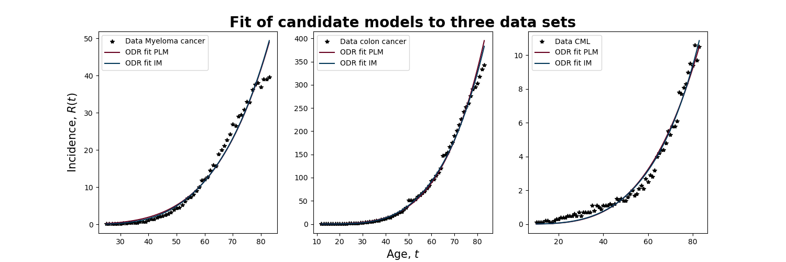

# Symmetry based model selection in the context of carcinogenesis
*Written by:* Johannes Borgqvist 
*Date:* 2021-02-17 

Welcome to the github-repositry *symmetry\_based_model\_selsection\_carcinogenesis*! This project is entirely written in Python meaning that it is open-source, and our aim is that the results in the article (**Reference to future article**) should be reproducable. Let's describe the project and all the relevant packages! 

## Description of the project
One of the greatest challenges in mathematical biology is that of model selection. Given some type of experimental data, it is often possible for the modeller to construct *multiple candidate models* that describe the same data. In the context of *mechanistic modelling* often relying on differential equations, the biological assumptions about the mechanism of the system of interest are encoded in the mathematical equations. This means that each of the candidate models encode a specific biological hypothesis, and by fitting the models to data we would validate a specific biological hypothesis. In practice, we would formulate this as a so called *model selection problem*: 

*Pick the model that best fits the data.* 

However, often it is not merely enough to select the model that best fits the data as multiple models might fit the same data equally well. In addition to the above criteria, there are numerous statistically based criteria for model selection which are ultimately based on the philosophical principle Occam's razor. Colloquially, we would formulate this as follows: 

*Pick the simplest model that best fits the data.* 

We argue that that we need a better criteria for model selection in mechanistic modelling which is based on the biological properties of the system at hand. Mathematically, we can encode such properties in so called *symmetries* which have been used with huge success in mathematical physics to encode conservation laws of various systems. Technically, symmetries are transformations that preserve solution curves of a given model. In our article, we propose a new criteria for model selection succintly formulated as follows: 

"*Select the model whose fit is invariant under transformations by its symmetries.*" 
In particular we study a concrete examples of two candidate models describing the increase in incidences of cancer due to ageing. If t is the age of the patients and R(t) is the number of incidences of cancer at age t, then we study two candidate models. The first one is called the *power law model* (PLM) given by

 

and the second candidate model is called the *immunological model* (IM-III) given by

 

## The required Python packages

## Running the scripts

